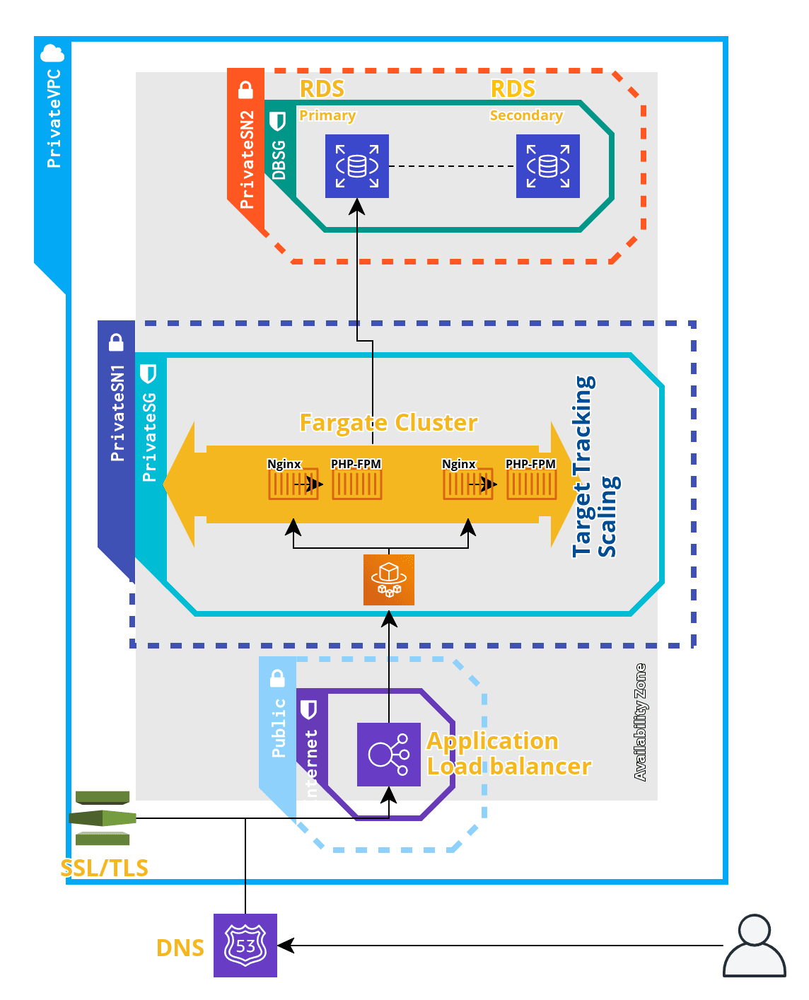

# DevOps-Challenge
Migrate On-premise service to AWS. 
The challenge: This web platform have a simple architecture. A web server (Nginx), running PHP for static and dynamic content. Mysql is used as Database.

I used a container model, so, the first step is dockerize the on-premise App.
Second I think that fargate is a very good option to host the app because is a very good way to modernize the infrastructure from development team to DevOps Team. Also is easier to deploy new features or fixes.

There are more ways to host in AWS the app, for example I can replicate the same on-premise architecture with EC2 instances (for example virtual machines), but to choose the best option I would like to have more context and architecture specification about the service.

The diagram represents the base architecture it can be more complex depending on the budget, so we can replicate the services in more availability zones for example

